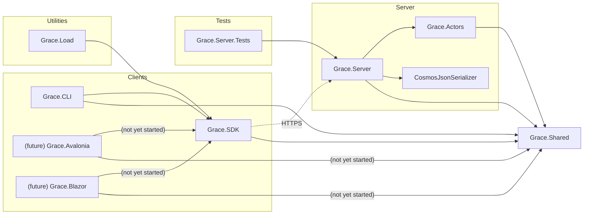

```mermaid
flowchart LR
    subgraph Server
    Grace.Server-->Grace.Actors
    Grace.Server-->CosmosJsonSerializer
    end

    subgraph Clients
    Grace.CLI-->Grace.SDK
    Grace.SDK-.->|HTTPS|Grace.Server
    Avalonia["(future) Grace.Avalonia"]-->|"(not yet started)"|Grace.SDK
    Blazor["(future) Grace.Blazor"]-->|"(not yet started)"|Grace.SDK
    end

    subgraph Utilities
    Grace.Load-->Grace.SDK
    end

    subgraph Tests
    Grace.Server.Tests-->Grace.Server
    end

    Grace.Actors-->Grace.Shared
    Grace.Server-->Grace.Shared
    Grace.CLI-->Grace.Shared
    Grace.SDK-->Grace.Shared
    Avalonia["(future) Grace.Avalonia"]-->|"(not yet started)"|Grace.Shared
    Blazor["(future) Grace.Blazor"]-->|"(not yet started)"|Grace.Shared

```
 